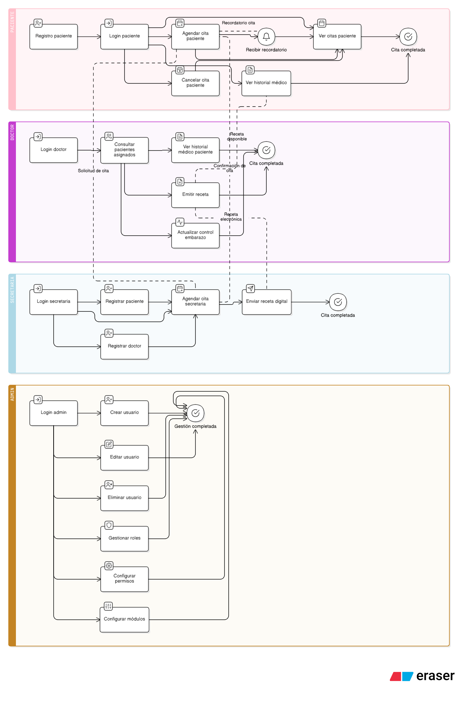

# 📊 Descripción del Diagrama de Casos de Uso – Sistema de Consultorio Obstétrico/Ginecológico

El diagrama de casos de uso ilustra las principales interacciones entre los **actores** (Paciente, Doctor, Secretaria y Admin) y el **sistema**. Muestra los flujos de actividades clave para la gestión de citas, historiales médicos, recetas electrónicas y la administración del sistema.

---

## 👥 Actores Principales

1. **Paciente**
   - Usuario externo que accede al sistema para gestionar sus citas y consultar su historial médico.
2. **Doctor**
   - Encargado de atender citas, emitir recetas electrónicas y actualizar controles de embarazo.
3. **Secretaria**
   - Personal administrativo que gestiona registros de pacientes y doctores, agenda citas y envía recetas electrónicas.
4. **Administrador (Admin)**
   - Responsable de crear, editar y eliminar usuarios, además de gestionar roles, permisos y módulos del sistema.

---

## 🔑 Descripción de Flujos por Actor

### 🩷 Paciente

- **Registro y Login:** Permite al paciente crear su cuenta y acceder de forma segura.
- **Agendar Cita:** Solicita citas médicas con disponibilidad del doctor.
- **Cancelar Cita:** Opción para anular una cita previamente agendada.
- **Ver Citas:** Consulta el estado y fecha de sus citas activas.
- **Ver Historial Médico:** Permite revisar los antecedentes y citas pasadas.
- **Recibir Recordatorio:** El sistema envía notificaciones automáticas sobre citas próximas.

---

### 💜 Doctor

- **Login:** Autenticación para acceder a sus módulos privados.
- **Consultar Pacientes Asignados:** Visualiza los datos y el historial de pacientes programados.
- **Ver Historial Médico del Paciente:** Permite revisar la historia clínica durante la cita.
- **Emitir Receta Electrónica:** Genera prescripciones médicas digitales para el paciente.
- **Actualizar Control de Embarazo:** Registra datos relevantes de gestación para seguimiento continuo.
- **Confirmación de Cita:** Indica que la cita fue completada con éxito.

---

### 💙 Secretaria

- **Login:** Permite el acceso con credenciales de secretaria.
- **Registrar Paciente:** Añade nuevos pacientes al sistema.
- **Registrar Doctor:** Permite incorporar nuevos doctores disponibles para citas.
- **Agendar Cita:** Gestiona las citas médicas por parte de los pacientes.
- **Enviar Receta Digital:** Remite las recetas generadas por el doctor al paciente.
- **Cita Completada:** Indica el final del flujo de atención.

---

### 🟠 Administrador

- **Login:** Autenticación para acceder al panel de administración.
- **Crear Usuario:** Permite añadir nuevos usuarios (pacientes, doctores o secretarias).
- **Editar Usuario:** Modifica datos de usuarios existentes.
- **Eliminar Usuario:** Elimina cuentas que ya no son necesarias.
- **Gestionar Roles:** Define roles con permisos específicos.
- **Configurar Permisos:** Ajusta niveles de acceso para cada rol.
- **Configurar Módulos:** Habilita o deshabilita funcionalidades del sistema.
- **Gestión Completada:** Cierre de los procesos administrativos.

---

## 🔎 Resumen de Flujos

- **Paciente ↔ Secretaria:** La secretaria asiste al paciente en la gestión de citas y envío de recetas.
- **Doctor ↔ Paciente:** El doctor atiende citas y actualiza historiales médicos.
- **Admin ↔ Sistema:** El administrador supervisa usuarios y configura los accesos al sistema.

---

## 📌 Observaciones

- El diagrama muestra relaciones directas (líneas sólidas) y dependencias (líneas punteadas).
- Ayuda a identificar los **flujos críticos del MVP:** login, agendar/ver citas, emisión de recetas y control de roles.
- Este diagrama servirá como base para definir los **módulos del backend y frontend** en el desarrollo.

---

